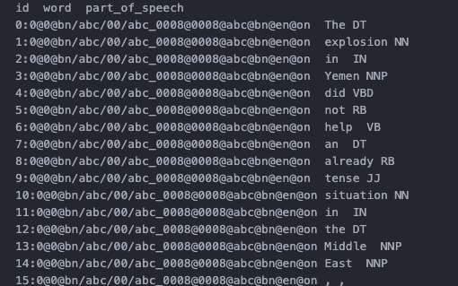
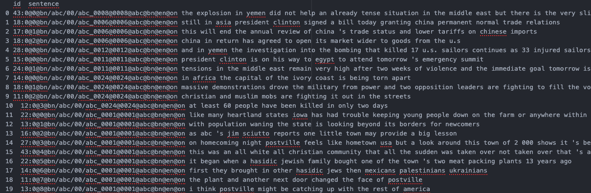
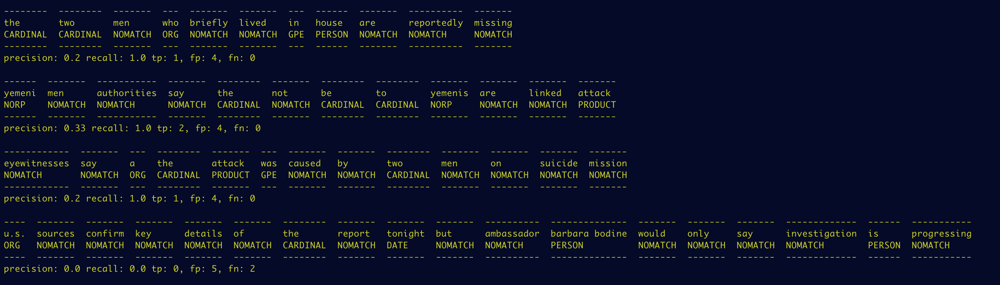
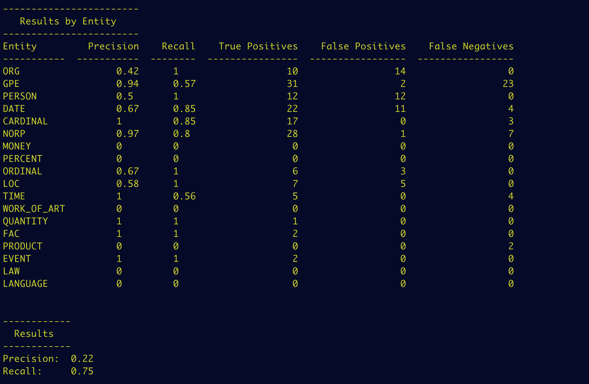
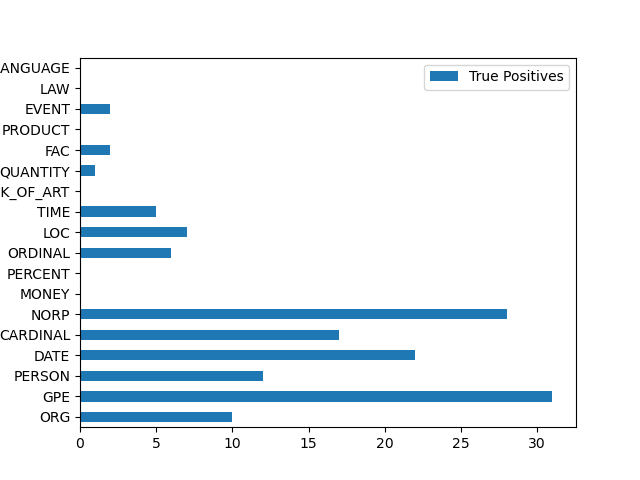
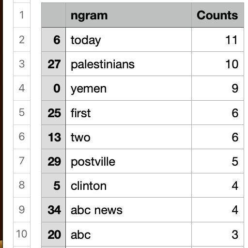

# neRecognizer

### 1. Usage and version information

Usage: . run.sh

Settings in config.py:

	input_data: Path to input tsv file, e.g. data/ontonotes_en_name_entity.tsv
	string_col: Name of text column, e.g. 'string' 
	entities_col: Name of entities column, e.g. 'type'
	ent_min_n: Counts threshold for removing scarce entities, e.g. 3
	train: Run training stage (True/False)
	test: Run testing stage (True/False)

Version 1:

- Sentence tokenization and iterative searching

Version 2:

- Simple search for lomgest match
- Compatible output with the name_entity.tsv

Version 3:
- Re-design for iterative search over token.tsv

Version 4:
- Scoring fixed
- Calculating scores by entity

### 1. Data Preparation

Reading the dev data line by line and adding completed sentences to a new csv.
Using the part_of_speech column to detect the end of sentences and empty lines

We can now read the sentences as one string and use the ids to search the train data for the true entity

### 2. Printing Results

Printing out the augmented sentences, using NOMATCH for empty tags.
Below the lines we get the local scores for each sentence.

Printing the final results. The first table contains results by entity. After that we get the overall scores for the devset.

A boxplot with the True Positives (Matched) counts per entity

These are the most frequent matches in the subset

